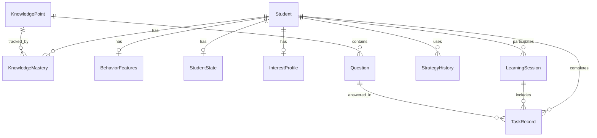

# 数据库设计

> 本文档定义系统的完整数据库模型。  
> 使用 **SQLite 3 + SQLModel ORM**，与 AstrBot 共用同一数据库。  
> 学习系统表与 AstrBot 原有表共存。

---

## 一、概览

### 存储策略

| 数据类型 | 存储方式 | 说明 |
|---------|---------|------|
| 结构化数据 | SQLite (SQLModel) | AstrBot 统一数据库 |
| 实时状态 | Python 内存 (dict) | 学生当前状态，会话结束持久化 |
| 文件 | AstrBot data 目录 | 上传的资料 |
| 向量检索 | FAISS | AstrBot 知识库模块 |
| 对话历史 | AstrBot ConversationV2 表 | 复用原有对话管理 |

### 数据库文件

```
{astrbot_data_dir}/
├── data.db                  # AstrBot 统一数据库（含学习系统表）
├── knowledge_base/          # FAISS 知识库索引
├── plugin_data/             # 插件数据
│   └── dedicated_tutor/     # 专属导师插件数据
└── dist/                    # 前端构建产物
```

### AstrBot 原有表（保留，不修改）

| 表名 | 用途 |
|------|------|
| `conversations` | 对话历史 |
| `personas` | 人格配置 |
| `platform_stats` | 平台统计 |
| `provider_stats` | LLM 调用统计 |
| `cron_jobs` | 定时任务 |
| `platform_sessions` | 会话管理 |
| `preferences` | 偏好设置 |
| `api_keys` | API Key |
| `attachments` | 附件 |
| ... | 其他 AstrBot 表 |

---

## 二、学习系统新增表（SQLModel）

### 在 `astrbot/core/db/po.py` 中新增

```python
from sqlmodel import Field, SQLModel, JSON, Text
from datetime import datetime, timezone
import uuid

# === 学习系统扩展表 ===

class Student(TimestampMixin, SQLModel, table=True):
    """学生档案"""
    __tablename__ = "students"
    
    id: str = Field(
        primary_key=True,
        default_factory=lambda: str(uuid.uuid4())
    )
    nickname: str = Field(max_length=255, nullable=False)
    avatar_path: str | None = Field(default=None)
    grade: int = Field(nullable=False)              # 年级 1-6
    age: int | None = Field(default=None)
    study_goal: str | None = Field(default=None, sa_type=Text)
    mode: str = Field(default="gentle", max_length=32)  # strict | gentle
    # student_uid 用于 AstrBot 平台通道绑定
    platform_uid: str | None = Field(default=None, max_length=255, unique=True)


class KnowledgePoint(TimestampMixin, SQLModel, table=True):
    """知识点（人教版小学数学）"""
    __tablename__ = "knowledge_points"
    
    id: str = Field(primary_key=True, default_factory=lambda: str(uuid.uuid4()))
    name: str = Field(max_length=255, nullable=False)
    code: str | None = Field(default=None, max_length=64, unique=True)
    grade: int = Field(nullable=False)               # 1-6
    semester: int = Field(default=1)                  # 1=上/2=下
    unit: int | None = Field(default=None)
    category: str | None = Field(default=None, max_length=64)  # number/geometry/statistics
    description: str | None = Field(default=None, sa_type=Text)
    difficulty_base: int = Field(default=3)
    parent_id: str | None = Field(default=None, max_length=36)
    sort_order: int = Field(default=0)


class Question(TimestampMixin, SQLModel, table=True):
    """题目"""
    __tablename__ = "questions"
    
    id: str = Field(primary_key=True, default_factory=lambda: str(uuid.uuid4()))
    content: str = Field(sa_type=Text, nullable=False)
    type: str = Field(max_length=32, nullable=False)   # choice/fill/solve
    difficulty: int = Field(nullable=False)              # 1-5
    answer: dict = Field(sa_type=JSON, nullable=False)
    solution_steps: list | None = Field(default=None, sa_type=JSON)
    hints: list | None = Field(default=None, sa_type=JSON)
    error_patterns: list | None = Field(default=None, sa_type=JSON)
    knowledge_ids: list | None = Field(default=None, sa_type=JSON)
    tags: list | None = Field(default=None, sa_type=JSON)
    source: str | None = Field(default=None, max_length=255)
    is_active: bool = Field(default=True)


class KnowledgeMastery(TimestampMixin, SQLModel, table=True):
    """知识掌握度 (A层)"""
    __tablename__ = "knowledge_mastery"
    
    id: str = Field(primary_key=True, default_factory=lambda: str(uuid.uuid4()))
    student_id: str = Field(nullable=False, index=True)
    knowledge_id: str = Field(nullable=False, index=True)
    mastery_score: float = Field(default=0.0)          # 掌握概率 0~1
    error_types: dict = Field(default_factory=dict, sa_type=JSON)
    forgetting_risk: float = Field(default=0.0)
    last_practiced: datetime | None = Field(default=None)
    evidence_count: int = Field(default=0)


class BehaviorFeatures(TimestampMixin, SQLModel, table=True):
    """行为特征 (B层)"""
    __tablename__ = "behavior_features"
    
    id: str = Field(primary_key=True, default_factory=lambda: str(uuid.uuid4()))
    student_id: str = Field(nullable=False, unique=True)
    planning_score: float = Field(default=0.5)
    impulsivity: float = Field(default=0.5)
    hint_dependency: float = Field(default=0.5)
    trial_error_ratio: float = Field(default=0.5)


class StudentState(TimestampMixin, SQLModel, table=True):
    """学生实时状态 (C层，运行时在内存，会话结束持久化)"""
    __tablename__ = "student_states"
    
    id: str = Field(primary_key=True, default_factory=lambda: str(uuid.uuid4()))
    student_id: str = Field(nullable=False, unique=True)
    attention_level: float = Field(default=0.7)
    fatigue_level: float = Field(default=0.0)
    frustration: float = Field(default=0.0)
    cognitive_load: float = Field(default=0.3)


class LearningSession(TimestampMixin, SQLModel, table=True):
    """学习会话"""
    __tablename__ = "learning_sessions"
    
    id: str = Field(primary_key=True, default_factory=lambda: str(uuid.uuid4()))
    student_id: str = Field(nullable=False, index=True)
    session_type: str = Field(default="learning", max_length=32)
    started_at: datetime = Field(nullable=False)
    ended_at: datetime | None = Field(default=None)
    duration_min: float | None = Field(default=None)
    end_reason: str | None = Field(default=None, max_length=64)
    summary: dict | None = Field(default=None, sa_type=JSON)
    initial_state: dict | None = Field(default=None, sa_type=JSON)
    final_state: dict | None = Field(default=None, sa_type=JSON)


class TaskRecord(TimestampMixin, SQLModel, table=True):
    """答题记录"""
    __tablename__ = "task_records"
    
    id: str = Field(primary_key=True, default_factory=lambda: str(uuid.uuid4()))
    session_id: str | None = Field(default=None, index=True)
    student_id: str = Field(nullable=False, index=True)
    question_id: str | None = Field(default=None)
    knowledge_ids: list | None = Field(default=None, sa_type=JSON)
    student_answer: str | None = Field(default=None, sa_type=Text)
    is_correct: bool | None = Field(default=None)
    error_type: str | None = Field(default=None, max_length=32)
    time_spent_sec: float | None = Field(default=None)
    hint_count: int = Field(default=0)
    attempt_count: int = Field(default=1)
    decision_reason: str | None = Field(default=None, sa_type=Text)
    difficulty: int | None = Field(default=None)


class InterestProfile(TimestampMixin, SQLModel, table=True):
    """兴趣层 (D层，MVP 手动设置)"""
    __tablename__ = "interest_profiles"
    
    id: str = Field(primary_key=True, default_factory=lambda: str(uuid.uuid4()))
    student_id: str = Field(nullable=False, unique=True)
    topic_prefs: dict = Field(default_factory=dict, sa_type=JSON)
    explanation_style: str = Field(default="balanced", max_length=32)


class StrategyHistory(TimestampMixin, SQLModel, table=True):
    """策略记录 (F层，MVP 仅记录)"""
    __tablename__ = "strategy_history"
    
    id: str = Field(primary_key=True, default_factory=lambda: str(uuid.uuid4()))
    student_id: str = Field(nullable=False, index=True)
    strategy_type: str = Field(max_length=64, nullable=False)
    strategy_value: str | None = Field(default=None, max_length=255)
    success_rate: float = Field(default=0.0)
    sample_count: int = Field(default=0)
    last_used: datetime | None = Field(default=None)
```

---

## 三、学习系统表关系



---

## 四、与 AstrBot 原有表的关联

| 学习系统概念 | AstrBot 原有表 | 关联方式 |
|-------------|---------------|---------|
| 学生对话历史 | `conversations` | 通过 `platform_uid` 关联 |
| 学生 IM 身份 | `platform_sessions` | 通过 `platform_uid` 关联 |
| 模式切换 | `personas` | 通过 `persona_id` 查 Persona 配置 |
| LLM 使用统计 | `provider_stats` | 自动记录（AstrBot 原生） |
| 学习资料 | FAISS 知识库 | 通过 AstrBot Knowledge Base API |

---

## 五、CRUD 方法扩展

在 `astrbot/core/db/sqlite.py` 中新增：

```python
# 学生 CRUD
async def create_student(self, student: Student) -> Student: ...
async def get_student(self, student_id: str) -> Student | None: ...
async def get_student_by_platform_uid(self, uid: str) -> Student | None: ...
async def update_student(self, student: Student) -> Student: ...

# 知识掌握度
async def get_mastery(self, student_id: str, knowledge_id: str) -> KnowledgeMastery | None: ...
async def upsert_mastery(self, mastery: KnowledgeMastery) -> KnowledgeMastery: ...
async def get_student_masteries(self, student_id: str) -> list[KnowledgeMastery]: ...
async def get_weak_points(self, student_id: str, limit: int = 10) -> list[KnowledgeMastery]: ...
async def get_forgetting_risks(self, student_id: str, threshold: float = 0.5) -> list[KnowledgeMastery]: ...

# 学习会话
async def create_session(self, session: LearningSession) -> LearningSession: ...
async def end_session(self, session_id: str, summary: dict) -> LearningSession: ...

# 答题记录
async def create_task_record(self, record: TaskRecord) -> TaskRecord: ...
async def get_session_tasks(self, session_id: str) -> list[TaskRecord]: ...
async def get_recent_tasks(self, student_id: str, limit: int = 20) -> list[TaskRecord]: ...

# 题库
async def get_questions(self, knowledge_ids: list[str] | None, difficulty: int | None, limit: int) -> list[Question]: ...
async def get_question(self, question_id: str) -> Question | None: ...

# 知识图谱
async def get_knowledge_tree(self, grade: int) -> list[KnowledgePoint]: ...
async def get_knowledge_point(self, kp_id: str) -> KnowledgePoint | None: ...

# 状态
async def save_student_state(self, state: StudentState) -> StudentState: ...
async def get_student_state(self, student_id: str) -> StudentState | None: ...
```

---

## 六、数据备份策略

AstrBot 自带备份功能（`dashboard/routes/backup.py`），学习系统数据随主库一起备份。

```python
# AstrBot 已有的备份机制，无需额外开发：
# - 管理面板手动备份
# - 定时自动备份（CronJob 配置）
# - 备份包含完整数据库 + 配置
```

---

## 七、数据初始化

### MVP 题库初始化

```python
# 硬编码 30-50 道六年级数学题
# 在 dedicated_tutor 插件的 initialize() 中执行
async def seed_questions(db):
    """初始化六年级数学题库"""
    questions = [
        Question(
            content="小明有 12 个苹果，给了小红 5 个，还剩多少个？",
            type="fill",
            difficulty=1,
            answer={"value": "7", "unit": "个"},
            solution_steps=[
                {"step": 1, "content": "找出已知条件", "detail": "有 12 个，给了 5 个"},
                {"step": 2, "content": "列算式", "detail": "12 - 5 = ?"},
                {"step": 3, "content": "计算结果", "detail": "12 - 5 = 7"},
            ],
            hints=[
                {"level": 1, "content": "想一想，'给了'是变多了还是变少了？"},
                {"level": 2, "content": "用减法来算：12 - 5 = ?"},
                {"level": 3, "content": "12 - 5 = 7，还剩 7 个苹果"},
            ],
            knowledge_ids=["subtraction-basics"],
            tags=["减法", "应用题", "六年级"],
        ),
        # ... 更多题目
    ]
    for q in questions:
        await db.create_question(q)
```
