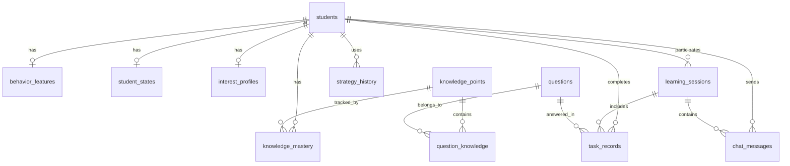

# 数据库设计

> 本文档定义系统的完整数据库模型。  
> 使用 **SQLite 3** 本地文件，零配置零运维。  
> **rusqlite** 直接读写，纯 SQL 建表。

---

## 一、概览

### 存储策略

| 数据类型 | 存储方式 | 说明 |
|---------|---------|------|
| 结构化数据 | SQLite 文件 | 所有核心数据 |
| 实时状态 | Rust 内存 (DashMap) | 学生当前状态，会话结束持久化 |
| 文件 | 本地文件系统 | 上传的资料 |
| 全文检索 | SQLite FTS5 | V2 知识检索、记忆召回 |

### 数据库文件

```
{app_data_dir}/
├── data.db                  # 主数据库
└── backups/                 # 定期自动备份
```

### SQLite 配置

```sql
PRAGMA journal_mode = WAL;    -- 写入不阻塞读取
PRAGMA foreign_keys = ON;     -- 外键约束
PRAGMA busy_timeout = 5000;   -- 忙等待 5s
```

---

## 二、用户与身份

```sql
-- 学生（MVP 聚焦小学，支持多学生切换）
CREATE TABLE students (
    id              TEXT PRIMARY KEY,            -- UUID
    nickname        TEXT NOT NULL,
    avatar_path     TEXT,
    grade           INTEGER NOT NULL,            -- 年级 1-6（小学）
    age             INTEGER,
    school_stage    TEXT NOT NULL DEFAULT 'primary', -- MVP 仅 primary
    study_goal      TEXT,
    created_at      TEXT DEFAULT (datetime('now')),
    updated_at      TEXT DEFAULT (datetime('now'))
);
```

---

## 三、内容资源

```sql
-- 知识点（人教版小学数学）
CREATE TABLE knowledge_points (
    id              TEXT PRIMARY KEY,
    name            TEXT NOT NULL,
    code            TEXT UNIQUE,                 -- 编码如 PEP-G1-S1-U3
    grade           INTEGER NOT NULL,            -- 1-6
    semester        INTEGER DEFAULT 1,           -- 1=上/2=下
    unit            INTEGER,                     -- 单元序号
    category        TEXT,                        -- number/geometry/statistics/algebra
    description     TEXT,
    difficulty_base INTEGER DEFAULT 3,           -- 1-5 基础难度
    parent_id       TEXT REFERENCES knowledge_points(id),
    sort_order      INTEGER DEFAULT 0,
    created_at      TEXT DEFAULT (datetime('now'))
);

-- 前置依赖
CREATE TABLE knowledge_prerequisites (
    knowledge_id    TEXT NOT NULL REFERENCES knowledge_points(id),
    prerequisite_id TEXT NOT NULL REFERENCES knowledge_points(id),
    PRIMARY KEY (knowledge_id, prerequisite_id)
);

-- 题目
CREATE TABLE questions (
    id              TEXT PRIMARY KEY,
    content         TEXT NOT NULL,               -- 支持 LaTeX
    type            TEXT NOT NULL,               -- choice/fill/solve
    difficulty      INTEGER NOT NULL,            -- 1-5
    answer          TEXT NOT NULL,               -- JSON
    solution_steps  TEXT,                        -- JSON [{step, content, detail}]
    hints           TEXT,                        -- JSON [{level, content}]
    error_patterns  TEXT,                        -- JSON [{type, pattern, feedback}]
    tags            TEXT,                        -- JSON ["加法", "进位"]
    source          TEXT,
    variant_of      TEXT REFERENCES questions(id),
    is_active       INTEGER DEFAULT 1,
    created_at      TEXT DEFAULT (datetime('now'))
);

-- 题目-知识点关联（多对多）
CREATE TABLE question_knowledge (
    question_id     TEXT NOT NULL REFERENCES questions(id),
    knowledge_id    TEXT NOT NULL REFERENCES knowledge_points(id),
    PRIMARY KEY (question_id, knowledge_id)
);

-- 讲解模板
CREATE TABLE explanations (
    id              TEXT PRIMARY KEY,
    knowledge_id    TEXT REFERENCES knowledge_points(id),
    style           TEXT,                        -- formal/story/analogy
    content         TEXT NOT NULL,
    created_at      TEXT DEFAULT (datetime('now'))
);
```

---

## 四、学生模型（6 层）

```sql
-- A层：知识掌握
CREATE TABLE knowledge_mastery (
    id              TEXT PRIMARY KEY,
    student_id      TEXT NOT NULL REFERENCES students(id),
    knowledge_id    TEXT NOT NULL REFERENCES knowledge_points(id),
    mastery_score   REAL DEFAULT 0.0,            -- 0~1 掌握概率
    error_types     TEXT DEFAULT '{}',           -- JSON {conceptual:3, careless:1}
    forgetting_risk REAL DEFAULT 0.0,            -- 0~1 遗忘风险
    last_practiced  TEXT,
    evidence_count  INTEGER DEFAULT 0,
    updated_at      TEXT DEFAULT (datetime('now')),
    UNIQUE(student_id, knowledge_id)
);

-- B层：行为特征
CREATE TABLE behavior_features (
    id              TEXT PRIMARY KEY,
    student_id      TEXT NOT NULL UNIQUE REFERENCES students(id),
    planning_score  REAL DEFAULT 0.5,
    impulsivity     REAL DEFAULT 0.5,
    hint_dependency REAL DEFAULT 0.5,
    trial_error_ratio REAL DEFAULT 0.5,
    updated_at      TEXT DEFAULT (datetime('now'))
);

-- C层：实时状态（运行时在内存，会话结束持久化）
CREATE TABLE student_states (
    id              TEXT PRIMARY KEY,
    student_id      TEXT NOT NULL UNIQUE REFERENCES students(id),
    attention_level REAL DEFAULT 0.7,
    fatigue_level   REAL DEFAULT 0.0,
    frustration     REAL DEFAULT 0.0,
    cognitive_load  REAL DEFAULT 0.3,
    session_start   TEXT,
    updated_at      TEXT DEFAULT (datetime('now'))
);

-- D层：兴趣层（MVP 手动设置）
CREATE TABLE interest_profiles (
    id              TEXT PRIMARY KEY,
    student_id      TEXT NOT NULL UNIQUE REFERENCES students(id),
    topic_prefs     TEXT DEFAULT '{}',           -- JSON {sports:0.8, scifi:0.6}
    explanation_style TEXT DEFAULT 'balanced',   -- formal/story/analogy/balanced
    updated_at      TEXT DEFAULT (datetime('now'))
);

-- F层：策略记录（MVP 仅记录，不优化）
CREATE TABLE strategy_history (
    id              TEXT PRIMARY KEY,
    student_id      TEXT NOT NULL REFERENCES students(id),
    strategy_type   TEXT NOT NULL,
    strategy_value  TEXT,
    success_rate    REAL DEFAULT 0.0,
    sample_count    INTEGER DEFAULT 0,
    last_used       TEXT,
    updated_at      TEXT DEFAULT (datetime('now'))
);
```

---

## 五、学习过程

```sql
-- 学习会话
CREATE TABLE learning_sessions (
    id              TEXT PRIMARY KEY,
    student_id      TEXT NOT NULL REFERENCES students(id),
    session_type    TEXT NOT NULL DEFAULT 'learning', -- learning/review/chat
    started_at      TEXT NOT NULL,
    ended_at        TEXT,
    duration_min    REAL,
    end_reason      TEXT,                        -- user_exit/timeout/fatigue
    summary         TEXT,                        -- JSON
    initial_state   TEXT,                        -- JSON 会话开始时的状态快照
    final_state     TEXT                         -- JSON 会话结束时的状态快照
);

-- 答题记录
CREATE TABLE task_records (
    id              TEXT PRIMARY KEY,
    session_id      TEXT REFERENCES learning_sessions(id),
    student_id      TEXT NOT NULL REFERENCES students(id),
    question_id     TEXT REFERENCES questions(id),
    knowledge_ids   TEXT,                        -- JSON
    student_answer  TEXT,
    is_correct      INTEGER,                     -- 0/1
    error_type      TEXT,                        -- conceptual/procedural/careless/strategic
    time_spent_sec  REAL,
    hint_count      INTEGER DEFAULT 0,
    attempt_count   INTEGER DEFAULT 1,
    modifications   INTEGER DEFAULT 0,           -- 修改次数
    decision_reason TEXT,                        -- 决策引擎给出的理由
    difficulty      INTEGER,
    created_at      TEXT DEFAULT (datetime('now'))
);

-- 事件日志（行为数据采集）
CREATE TABLE event_logs (
    id              INTEGER PRIMARY KEY AUTOINCREMENT,
    student_id      TEXT NOT NULL,
    session_id      TEXT,
    event_type      TEXT NOT NULL,               -- answer_correct/wrong/hint/pause...
    event_data      TEXT,                        -- JSON
    created_at      TEXT DEFAULT (datetime('now'))
);
```

---

## 六、对话

```sql
-- 对话消息
CREATE TABLE chat_messages (
    id              TEXT PRIMARY KEY,
    session_id      TEXT REFERENCES learning_sessions(id),
    student_id      TEXT NOT NULL REFERENCES students(id),
    role            TEXT NOT NULL,               -- user/assistant/system
    content         TEXT NOT NULL,
    intent          TEXT,                        -- learning/chat/command
    extracted_info  TEXT,                        -- JSON 从对话中提取的信息
    created_at      TEXT DEFAULT (datetime('now'))
);

-- 对话状态
CREATE TABLE chat_state (
    id              TEXT PRIMARY KEY,
    student_id      TEXT NOT NULL UNIQUE REFERENCES students(id),
    current_state   TEXT DEFAULT 'learning',     -- learning/chatting/resting
    chat_time_today REAL DEFAULT 0,
    chat_count_today INTEGER DEFAULT 0,
    last_chat_at    TEXT,
    cooldown_until  TEXT
);
```

---

## 七、索引

```sql
CREATE INDEX idx_mastery_student ON knowledge_mastery(student_id);
CREATE INDEX idx_mastery_knowledge ON knowledge_mastery(knowledge_id);
CREATE INDEX idx_tasks_student ON task_records(student_id, created_at);
CREATE INDEX idx_tasks_session ON task_records(session_id);
CREATE INDEX idx_sessions_student ON learning_sessions(student_id, started_at);
CREATE INDEX idx_events_student ON event_logs(student_id, created_at);
CREATE INDEX idx_qk_knowledge ON question_knowledge(knowledge_id);
CREATE INDEX idx_chat_student ON chat_messages(student_id, created_at);
```

---

## 八、表关系



---

## 九、数据备份策略

- **WAL 模式**：读写不互相阻塞
- **定时备份**：每日自动备份到 `backups/` 目录
- **导出**：支持导出为 JSON 用于迁移

```rust
// 备份逻辑
pub fn backup_database(db_path: &Path) -> Result<()> {
    let backup_dir = db_path.parent().unwrap().join("backups");
    fs::create_dir_all(&backup_dir)?;
    let timestamp = chrono::Local::now().format("%Y%m%d_%H%M%S");
    let backup_path = backup_dir.join(format!("data_{}.db", timestamp));
    fs::copy(db_path, &backup_path)?;
    // 保留最近 7 天的备份
    cleanup_old_backups(&backup_dir, 7)?;
    Ok(())
}
```
